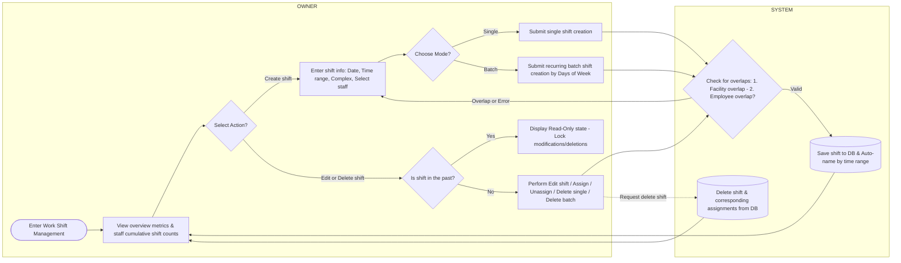
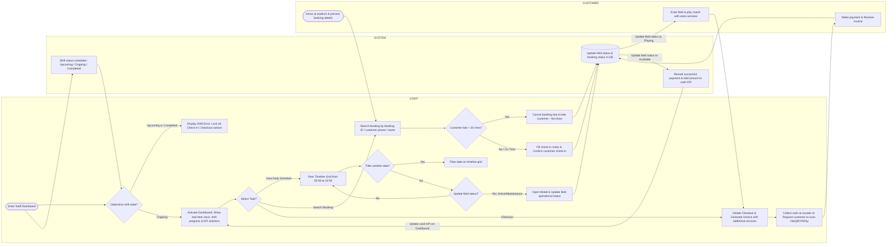
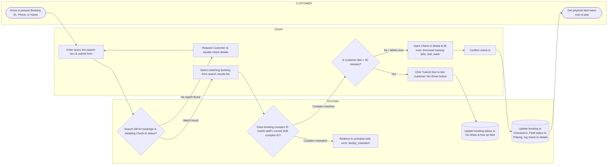

# Work Shift Management & Field Operations Business Process Specification

This document details the business processes for **Work Shift Management**, the **Staff Dashboard**, and the **Daily Schedule** of the Sport Field Booking system. All diagrams are structured horizontally (`flowchart LR`) for optimal rendering in Mermaid tools.

---

## 1. Process 1: Work Shift Configuration (Owner & System)

This workflow represents the activities performed by the **Owner** to configure shifts, assign staff, and manage historical schedules, alongside the validation and persistence rules enforced by the **System**.

### Shift Configuration Business Rules:
1. **Cumulative Shift Counts**: Helps the Owner optimize human resource allocation by tracking the total number of shifts completed by each employee.
2. **Auto-naming Convention**:
   * Hours `08:00 - 12:00`: Auto-named `Morning Shift + [Complex Short Name]`.
   * Hours `12:00 - 18:00`: Auto-named `Afternoon Shift + [Complex Short Name]`.
   * Hours `18:00 - 22:00`: Auto-named `Evening Shift + [Complex Short Name]`.
   * Other hours: Auto-named `Split Shift + [Complex Short Name]`.
3. **Overlap Constraints**:
   * **Facility Overlap**: A complex cannot have more than 1 work shift scheduled for the same time slot on the same day.
   * **Employee Overlap**: A staff member cannot be assigned to multiple shifts with overlapping hours on the same day.
4. **Historical Lock**: Any shift that has ended (in the past) is automatically locked in a "Read-Only" state to maintain database integrity.

---

## 2. Process 2: Field Operations & Scheduling (Staff, System & Customer)

This workflow represents the operations performed by the **Staff** during their shift, the journey of the **Customer** checking in/playing/checking out, and the updates executed by the **System**.

### Shift Operations Business Rules:
1. **Time Constraints**: To ensure billing and auditing accuracy, staff are only permitted to perform Check-in/Checkout operations while their assigned shift is in the **Ongoing** state.
2. **Timeline Grid**: Renders booking allocations from `05:00` to `22:00`. Allows date switching and manual updates to field statuses (e.g., setting a field to *Maintenance* blocks online bookings for that slot).
3. **No-Show Cancellation**: If a customer is late by more than 30 minutes, staff can cancel the booking under a "No-show" status, freeing up the field slot for walk-in customers.
4. **Cash KPI Synchronization**: All completed invoice collections (Cash or Digital QR/Gateway) instantly increment the staff's Cash KPI total on their dashboard, ensuring accurate cash drawer reconciliations at the end of the shift.

---

## 3. Process 3: Detailed Customer Check-in Flow (Staff, Customer & System)

This workflow maps out the granular, step-by-step check-in procedure, search handling, facility checks, check-in note entry, and field status transitions.

### Detailed Check-in Business Rules:
1. **Search Parameters**: Staff can lookup bookings in real-time by entering the Booking ID (e.g., `BK001`), the Customer's phone number, or the Customer's name.
2. **Facility Authorization**: To prevent staff from unauthorized cross-facility alterations, the System strictly blocks check-in requests if the booking belongs to a different complex than the staff's currently active shift.
3. **Check-in Notes**: Rented equipment (bibs, soccer balls, etc.) are typed into the check-in notes textarea to verify inventory during return checkout.
4. **Visual Synchronization**: Upon successful check-in, the System transitions the booking state to `Checked-in` and the field state to `Playing`, turning the grid cell green instantly on the daily schedule layout.
